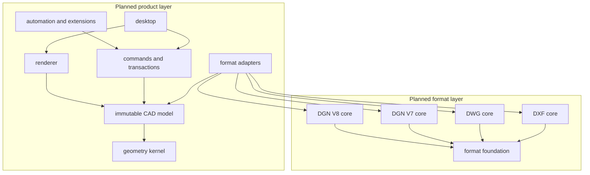

# Architecture

## Status

Only the DXF runtime described below exists today. The multi-format, CAD-model,
renderer, desktop, automation, and plugin boundaries in this document are
planned contracts from the [master implementation plan](IMPLEMENTATION_PLAN.md),
not current support claims. The detailed active DXF program is preserved under
[`plans/dxf-core-1.0/`](plans/dxf-core-1.0/IMPLEMENTATION_PLAN.md).

## Core boundary

`seacad-dxf-core` owns DXF source access, lossless group records, dialects,
typed semantics, topology, transactions, and writers. It does not own rendering,
selection UX, snapping, CAD commands, geometry booleans, filesystem resolution
for external references, scripting, plugins, or GUI code.

`seacad-cli` is the first consumer and verification shell. It may format human
and versioned JSON reports and aggregate offline corpus receipts, but it must
not implement parsing or semantic rules. The corpus harness delegates every
selected file to the strict DXF core and owns only bounded traversal,
aggregation, and privacy redaction.

## Data flow

```text
file/bytes -> bounded source -> raw records -> indexes -> lazy semantic views
                                      |                       |
                                      +-> verbatim writer     +-> transaction
                                                                  |
                                                       validated new snapshot
```

Raw bytes are the source of truth. Semantic and geometric models are derived,
source-anchored views. Unsupported and malformed content remains explicit and
is never silently dropped.

## Internal read-projection construction

`seacad-dxf-core` keeps shared construction mechanics behind the crate-private
`read_support` module. That module owns only checked compact-index conversion,
source-identity agreement, cooperative cancellation, and path-redacted
`Read`-operation mappings for impossible internal data or allocation failure.
It does not own group selection, cardinality, defaults, domain validation,
topology, geometry, or support policy; those decisions remain in their exact
source-anchored semantic modules.

Higher semantic layers retain their immediate lower-layer directory as evidence.
Shared mechanics may remove duplicated implementation, but must not flatten raw
provenance, hide typed failures, or let an upper layer reinterpret a lower
layer's domain contract.

## Future boundaries

After DXF Core 1.0, the planned open format layer consists of one minimal
`seacad-format-foundation` crate plus independent DXF, DWG, DGN V7, and DGN V8
cores. A small DGN facade may select V7 or V8, but neither implementation may
depend on the other. Format cores expose their native physical and semantic
models and do not depend on a universal CAD entity enum.

Proprietary product-layer adapters translate reviewed format semantics into an
immutable CAD snapshot. The CAD model depends on a format-neutral geometry
kernel; commands depend on the CAD model; rendering consumes snapshots; and
the desktop depends on the command and rendering interfaces. No dependency may
point from a format core into the product layer.

A format-neutral command API serves the GUI, CLI, `.scr`, Rhai, CadLisp,
process-isolated Python and Luau workers, sandboxed WASM/WIT plugins, SDKs, and
MCP. These hosts cannot mutate parser memory or bypass validated document
transactions.



## Planned command and write contracts

CAD snapshots use stable document/entity identifiers, explicit units and
coordinate frames, and monotonically increasing revisions. The planned
`seacad.command/v1` protocol requires a stable command id, schema version,
arguments, expected revision, and capability context. Revision mismatch fails
closed; it never triggers an implicit merge.

Every native write follows this sequence:

```text
source bytes -> immutable format snapshot -> immutable CAD snapshot
             -> command preview/apply -> native format transaction
             -> create-new destination -> strict reopen
             -> semantic verification -> receipt and undo evidence
```

An adapter rejects an edit when it cannot prove that the target format can
represent the change without damaging unsupported data. Source files are never
overwritten in place.

## Theme boundary

The planned distributable theme format is a `.seacad-theme` ZIP archive with
`manifest.toml`, `theme.toml`, optional `icons/`, optional licensed `fonts/`, an
optional `preview.png`, and asset license files. Development mode may load the
same structure from an unpacked directory for hot reload.

Theme schema `seacad.theme/v1` permits one parent theme and stable semantic
tokens for colors, viewport roles, typography, spacing, radii, borders, and
icons. Colors use `#RRGGBB` or `#RRGGBBAA` sRGB spelling and dimensions use
logical device-independent pixels. Missing values fall back through the parent
and built-in base theme before user accessibility overrides are applied.

Themes cannot contain CSS, HTML, JavaScript, native code, network references,
layout selectors, command overrides, or message translations. The loader
rejects traversal, absolute paths, symlinks, executable assets, duplicate
normalized paths, oversized entries, inheritance cycles, and unlicensed
bundled assets. Invalid themes fall back to the built-in safe theme without
preventing application startup.

## Platform boundary

Format, geometry, command, CLI, and SDK contracts target Windows, Linux, and
macOS on x64 and ARM64. GUI support is evidence-tiered: Windows x64 first,
followed by Linux x64 and macOS ARM64; another target is promoted only after
real GPU, text, font, IME, packaging, and workflow evidence passes there.

World coordinates remain `f64`. Rendering rebases data to a camera- or
chunk-local origin rather than narrowing document truth. Units, axis order,
CRS identity, grid-data version, and transform provenance remain explicit; no
layer silently guesses or converts a CRS.

## Internationalization boundary

SeaCad is a multilingual product. English (`en`) is the canonical fallback and
Vietnamese (`vi`) is a first-class baseline locale; later locales use the same
catalog contract rather than adding language branches to business code. The
current CLI already follows this direction with complete compile-time English
and Vietnamese catalogs.

After DXF Core 1.0, one presentation-only localization boundary will serve the
GUI, CLI human output, command help, theme metadata, declarative plugin UI, and
human-readable MCP descriptions. The document, geometry, command, transaction,
format, and rendering cores remain locale-neutral. Stable command IDs, error
codes, JSON keys and values, MCP schemas, WIT/RPC contracts, logs, and receipts
must not change with the selected language.

Locale identifiers use normalized BCP 47 tags. GUI selection precedence is an
explicit user setting, then the operating-system locale, then English. CLI
selection remains explicit through `--lang` and defaults to English for
reproducible automation. Missing messages fall back through the locale's
declared parent and finally English; missing English entries fail catalog
validation. Drawing text, symbol names, layer names, file payloads, and user
script source are never automatically translated.

Plugin catalogs are namespaced by plugin ID and cannot replace host messages.
Themes may supply font-family roles and localized metadata but never message
translations or executable localization logic. UI acceptance tests cover
Vietnamese diacritics, Unicode font fallback, IME composition, text expansion,
plural and number formatting, right-to-left layout readiness, missing-message
fallback, and pseudo-localization before an additional locale is advertised.

## Implementation language boundary

DXF Core 1.0 is Rust-first and keeps its parsing, preservation, semantics,
transactions, and writers in safe Rust. C or C++ is not introduced for
speculative performance: streaming layout, allocation counts, indexing, cache
budgets, and algorithms are measured before language-level escape hatches are
considered.

A future native dependency requires either a reproducible benchmark proving a
specific bottleneck or a uniquely capable licensed library that is impractical
to replace. It must be isolated behind a small C ABI or a separate process;
C++ ABI types never cross a SeaCad public boundary. Any `unsafe` code is
confined to a separately audited bridge crate while `seacad-dxf-core` retains
`#![forbid(unsafe_code)]`.

Script and plugin languages do not alter this boundary. Luau, Python, and
CadLisp use the automation API; WASM uses WIT. They cannot mutate parser memory
directly and all CAD edits still pass through validated transactions.
