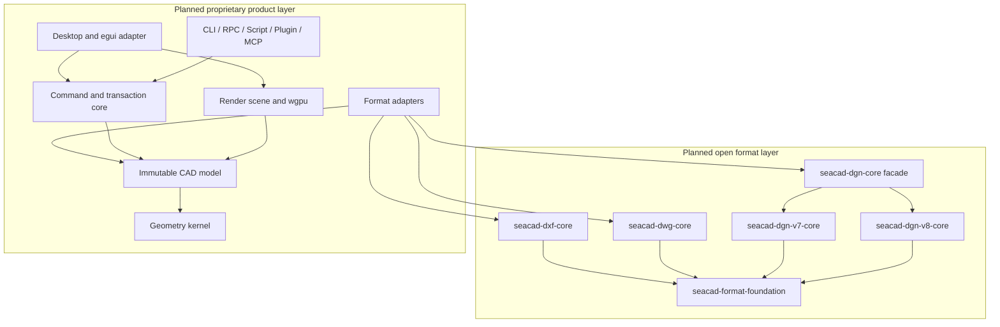

# SeaCad Master Implementation Plan

Status: R0 is complete through checkpoint
`r0-exit-apache-2.0-authorization`. Apache-2.0 only is authorized for the exact
future public `seacad-formats` boundary; the current mixed repository remains
proprietary and no export or publication has occurred. DXF Core 1.0 remains the
only active product implementation program, currently documented through
checkpoint M14.4m. Its preserved detailed plans are:

- [DXF Core 1.0 implementation subplan](plans/dxf-core-1.0/IMPLEMENTATION_PLAN.md)
- [DXF entity semantic completion subplan](plans/dxf-core-1.0/DXF_ENTITY_COMPLETION_PLAN.md)

This master plan coordinates the long-term product without increasing any
current support claim. [The support matrix](SUPPORT_MATRIX.md) remains the sole
normative capability boundary.

## 1. Product verdict and locked decisions

SeaCad is feasible as a staged replacement for selected infrastructure and
survey CAD workflows. It is not planned as an immediate or feature-for-feature
replacement for every AutoCAD 3D and MicroStation V8i capability. For one
developer assisted by AI, broad coverage is a multi-year program; completion is
measured by verified workflows rather than command counts.

| Topic | Locked decision |
| --- | --- |
| Product goal | Replace prioritized infrastructure/survey workflows |
| Delivery model | One active evidence-backed micro-milestone at a time |
| First application | DXF desktop MVP after DXF Core 1.0 |
| Format scope | DXF AC1009-AC1032; DWG R14-current; DGN V7 and V8 |
| Clean-room rule | Legal specifications, authored evidence, and isolated behavioral oracles only; no third-party parser source |
| Rust boundary | Minimal format cores; audited pinned Rust dependencies in later product layers |
| Open-core target | Exact R0.3 format boundary under Apache-2.0 only when separately exported; product layers remain proprietary |
| Desktop stack | `winit`, `wgpu`, and `egui`, isolated behind SeaCad-owned adapters |
| Themes | Declarative tokens and semantic style roles; no executable code or layout replacement |
| Automation | `.scr`, CadLisp/AutoLISP subset, Rhai, process-isolated Python and Luau |
| Plugins | WASM Component Model/WIT plus capability-scoped process RPC |
| AI | CLI, MCP, and SDK adapters first; models remain outside the core |
| Localization | English (`en`) canonical fallback, Vietnamese (`vi`) first-class, later languages through normalized BCP 47 catalogs |
| Platforms | Core parity on Windows/Linux/macOS, x64 and ARM64; GUI support is tiered |
| Survey coordinates | `f64` world coordinates, render-origin rebasing, explicit units and CRS provenance |

The open-source license target is not active until R0 provenance and ownership
review succeeds. The repository's current license remains authoritative until
that named checkpoint explicitly changes it.

## 2. Target dependency architecture

Arrows below point from a consumer to a dependency.



### 2.1 Format layer

- `seacad-format-foundation` owns only bounded byte sources, source identity,
  spans and provenance, resource limits, cancellation, diagnostics, and opaque
  payload contracts.
- Each format core owns its native physical representation and semantic views.
  DXF, DWG, DGN V7, and DGN V8 are not forced into one universal entity enum.
- Format cores never depend on the CAD model, renderer, GUI, command engine,
  scripts, plugins, or AI.
- The minimum schemas and generators needed to reproduce a public format crate
  ship with that crate. Application packaging and commercial release tooling
  remain outside the open format workspace.

### 2.2 Product layer

- Format adapters map native semantic evidence to an immutable format-neutral
  CAD snapshot and map supported CAD changes back to native transactions.
- The geometry kernel has no file-format or UI dependency.
- The renderer consumes snapshots and render caches; it never owns document
  truth.
- GUI, CLI, scripts, plugins, SDKs, and MCP invoke one command API and cannot
  mutate parser or document memory directly.

### 2.3 Mandatory write flow

```text
source bytes
  -> immutable format snapshot
  -> immutable CAD snapshot
  -> command preview/apply
  -> native format transaction
  -> create-new destination
  -> strict reopen
  -> semantic postcondition verification
  -> receipt and undo evidence
```

If an adapter cannot prove that an edit is representable without damaging
unknown data, it rejects the edit. SeaCad writers never overwrite a source
file in place.

## 3. Planned public contracts

### 3.1 Format API

- SemVer-versioned Rust APIs expose open options, resource limits, source
  identity, diagnostics, immutable raw snapshots, format-native semantic views,
  transaction plans, and create-new verified writers.
- Public support uses this ladder:
  `Detected -> RawLossless -> SemanticRead -> Renderable -> Editable -> VerifiedWrite -> ProductionQualified`.
- A capability claim is scoped by format family, version/dialect, object or
  entity family, physical representation, and operation.

### 3.2 CAD and command API

- CAD snapshots use stable document/entity identifiers, explicit units and
  coordinate frames, and monotonically increasing revisions.
- Command protocol namespace `seacad.command/v1` carries a stable command id,
  schema version, arguments, expected revision, and capability context.
- A command produces either a preview or a receipt containing before/after
  revisions, diagnostics, a bounded change summary, and undo evidence.
- Revision mismatch fails closed; the command layer never silently merges a
  stale mutation.
- Stable identifiers, JSON keys, enum values, error codes, WIT, RPC, and MCP
  schemas remain English and locale-neutral.

### 3.3 Automation and plugin API

- JSON-RPC v1 is the language-neutral process boundary. The Python SDK is
  generated from the same schema used by Rust, Luau, and external workers.
- WASM plugins use versioned WIT worlds and deny-by-default capabilities.
- Filesystem, network, document mutation, UI contribution, and long-running
  jobs are separate capabilities with explicit limits.
- Native Rust dynamic-library plugins are outside v1 because Rust has no stable
  cross-toolchain ABI and an in-process plugin could crash the host.
- MCP resources are read-only by default. Mutation is split into preview and
  apply; apply requires an approval token bound to the exact document revision.

### 3.4 Theme package v1

The planned distributable extension is `.seacad-theme`, a ZIP archive with this
fixed layout:

```text
theme-name.seacad-theme
|-- manifest.toml
|-- theme.toml
|-- icons/          # optional SVG or PNG assets
|-- fonts/          # optional licensed TTF/OTF assets
|-- preview.png     # optional
`-- licenses/       # required for redistributed third-party assets
```

Development mode may load the same structure from an unpacked directory for
hot reload. Distribution mode accepts only the archive.

`manifest.toml` contains schema `seacad.theme/v1`, a reverse-domain theme id,
SemVer version, exactly one parent theme, engine compatibility bounds, author,
license, and localized display metadata. `theme.toml` contains only stable
semantic roles for:

- surface, text, interaction, diagnostic, and syntax colors;
- viewport background, grids, crosshair, selection, and snap markers;
- UI and monospace typography roles;
- spacing, radius, border, and icon mappings.

Colors use `#RRGGBB` or `#RRGGBBAA` sRGB spelling; dimensions use logical
device-independent pixels. Resolution order is built-in base, parent theme,
selected theme, then user accessibility overrides. Missing or invalid values
fall back through that chain and emit diagnostics.

Themes cannot contain CSS, HTML, JavaScript, native code, network references,
filesystem paths outside the package, localization replacements, command
overrides, or layout selectors. Archives reject absolute paths, `..`, symlinks,
executables, duplicate normalized paths, oversized entries, inheritance
cycles, and unlicensed bundled assets. A theme failure never prevents safe-mode
startup with the built-in default theme.

### 3.5 Localization contract

- English (`en`) is the complete canonical fallback catalog. Vietnamese (`vi`)
  is a first-class baseline locale and must reach catalog parity before a
  user-facing feature is released.
- Additional languages use normalized BCP 47 tags, a declared parent locale,
  and the same versioned message contract. Missing messages fall back through
  the parent chain and finally English; missing English entries fail catalog
  validation.
- GUI locale precedence is explicit user setting, operating-system locale,
  then English. CLI human output remains explicit through `--lang` and defaults
  to English for reproducible automation.
- Localization is presentation-only. Format, geometry, CAD model, command,
  transaction, rendering, and persistence code cannot branch on language.
- Stable command ids, error codes, JSON keys and values, WIT/RPC/MCP schemas,
  logs, receipts, and serialized document data remain locale-neutral English
  identifiers.
- Command help, GUI labels, CLI human output, theme metadata, declarative plugin
  UI, and human-readable MCP descriptions use catalogs. Plugin catalogs are
  namespaced by plugin id and cannot replace host messages.
- Drawing text, layer/level and symbol names, file payloads, paths, and user
  script source are never automatically translated.

## 4. Ordered roadmap

### R0 - Governance, plan reset, and licensing evidence

1. R0.1 archives the detailed DXF plans, installs this master plan, updates live
   navigation and architecture notes, and preserves historical audit receipts.
2. R0.2 inventories ownership, contribution provenance, generated data,
   fixtures, dependency licenses, and the exact proposed open/private boundary.
   Its engineering inventory and non-authorization verdict are recorded in
   [the R0.2 audit](audits/R0_2_PROVENANCE_OWNERSHIP_BOUNDARY.md).
3. R0.3 designs a public `seacad-formats` workspace export without changing the
   current DXF core or publishing code. The exact two-member layout, generator
   split, allowlists, legal/SBOM closure, CI matrix, and non-authorization gates
   are recorded in [the R0.3 design](audits/R0_3_PUBLIC_FORMATS_WORKSPACE_EXPORT_DESIGN.md).
4. R0 exits only after legal/provenance review authorizes an explicit license
   checkpoint. The controller selected Apache-2.0 only for the exact R0.3
   boundary; scope, current-repository non-effect, and implementation gates are
   recorded in [the R0 exit decision](audits/R0_EXIT_APACHE_2_0_AUTHORIZATION.md).
   No current support claim changes during R0.

### R1 - Complete DXF Core 1.0

- Continue the preserved M14 subplan without introducing GUI, CAD IR, DGN, or
  DWG responsibilities into `seacad-dxf-core`.
- Complete the entity semantic/edit/write matrix, malformed and bounded-input
  coverage, corpus threshold, and required six-native receipts.
- After the Core 1.0 gate, define a small stable reader/document/transaction/
  writer facade while retaining detailed evidence APIs as unstable until their
  compatibility contract is proven.
- Split reproducible format-schema generation from application release tooling
  only when the public workspace is created and generated output is unchanged.

### R2 - CAD foundation and command engine

- Add closed `cad-types`, immutable `cad-model`, geometry primitives, spatial
  indexing, tolerance context, selection, and command transaction crates.
- Preserve `f64` world coordinates. Renderer-facing data is rebased to a local
  camera or chunk origin instead of narrowing document truth.
- CRS metadata includes authority/code, axis order, units, grid-data version,
  and provenance. SeaCad never guesses or silently converts a CRS.
- Exit with a headless DXF workflow that opens, maps to a CAD snapshot, previews
  and applies a command, undoes it, writes a new DXF, strictly reopens it, and
  proves unknown data unchanged or rejects the edit.

### R3 - Desktop DXF MVP

- Add audited, exactly pinned `winit`, `wgpu`, and `egui` dependencies behind
  SeaCad-owned platform, renderer, and UI adapters.
- Implement open/inspect, model/paper-space navigation, pan/zoom/orbit,
  wireframe and supported shaded geometry, layers, properties, command line,
  selection, crossing/window selection, and core snap modes.
- Add runtime GUI language selection with complete English and Vietnamese
  catalogs, parent/English fallback, font fallback, and IME-safe text input.
- Implement only edits already backed by verified DXF transactions: transform,
  copy, delete, supported primitive creation, undo/redo, and Save As.
- Add built-in light/dark themes and the validated theme package described
  above.
- Windows x64 is the first GUI tier, followed by Linux x64 and macOS ARM64.
  Other existing CI targets keep core/headless coverage until real GPU, font,
  and IME evidence promotes them.

### R4 - Automation, plugins, SDK, and AI boundary

Implement in this order:

1. deterministic `.scr` command streams;
2. bounded in-process Rhai;
3. JSON-RPC v1 and generated Python SDK/process worker;
4. capability-scoped WASM/WIT plugin host;
5. Rust-native CadLisp interpreter with an explicit AutoLISP compatibility
   matrix;
6. optional Luau process worker;
7. MCP server and AI CLI adapters.

Visual LISP/COM, DCL, binary ARX, and native MDL compatibility are outside v1.
Plugin or worker failure cancels uncommitted work and cannot corrupt a document.
All command help and human-readable automation metadata use the shared
English/Vietnamese catalog contract without changing stable protocol fields.

### R5 - DGN V7 and first survey workflow

- Build a separate public DGN V7 core through raw framing, exact unchanged
  replay, semantic elements, CAD adaptation, rendering, source-bound edits,
  and verified writing.
- Prioritize design header, units/global origin, 2D/3D elements, levels, cells,
  complex chains/shapes, text/font references, tags/linkages, references, and
  view metadata.
- Add survey points, breaklines, TIN, contours, coordinate transforms, level/
  cell/reference management, and volume computations in product layers.
- MicroStation V8i SS4 is an isolated behavioral oracle, never a parser source
  or runtime dependency.

### R6 - DGN V8

- Use a DGN V8 core separate from V7.
- Progress through container/raw objects, models/elements/levels, cells and
  references, styles/text/dimensions, application/EC envelopes, rendering,
  selective editing, and verified writing.
- Unknown structures remain bounded opaque evidence. Writer work starts only
  after checksums, unknown-object preservation, strict reopen, and oracle
  evidence are independently proven.

### R7 - DWG R14 through current families

- Do not use ODA, RealDWG, or another proprietary runtime in the base plan.
- Research and qualify families in order: R14, 2000, 2004, 2007, 2010, 2013,
  and 2018/current.
- Each family progresses independently through probe/header, physical sections
  and checksums/compression, object map and classes, semantic views, CAD
  adaptation, verified new-file writing, source-bound editing, and cross-family
  Save As.
- Custom, encrypted, application, ACIS/modeler, and unsupported class data is
  preserved opaque or causes an edit to fail closed.
- Support is reported as `family x capability x entity/object`, never as an
  unqualified "DWG supported" claim.

### R8 - Native geometry, survey, and SeaCad project format

Implement the geometry program in order:

1. robust predicates, intersections, transforms, curves, and tessellation;
2. TIN/terrain, contours, alignments/profiles, and large-coordinate workflows;
3. NURBS curves/surfaces, trimming, and mesh validation/repair;
4. deterministic 2D geometric constraints;
5. manifold B-rep, extrude/revolve/sweep/loft, and booleans;
6. fillet/chamfer/shell, bounded healing, and feature history.

Tolerance belongs to a document or operation context; there is no global
epsilon or silent healing. A native `.seacad` package is introduced only when
the CAD model has verified features that cannot be represented losslessly in
DXF, DGN, or DWG. Export must explicitly reject, retain in `.seacad`, or create
a new tessellated/exploded representation; it never silently loses history.

### R9 - Product qualification

- Add clean-room SHX and MicroStation RSC readers, user-supplied proprietary
  fonts, xref resolution, raster/underlay, layouts/sheets, plotting/PDF, print
  preview, autosave/recovery, safe mode, installers, signing, and settings
  migration.
- Advertise an additional locale only after complete English-key coverage,
  parent fallback, pseudo-localization, text-expansion, font, IME, plural, and
  number-format tests pass for that locale.
- Extension safe mode must open and rescue a document when a theme, script, or
  plugin is broken.
- Production claims require representative workflow checklists, corpus and
  performance evidence, fuzzing, and the required six-native receipt sequence.

## 5. Verification and acceptance policy

### Format and writer tests

- Use public authored fixtures, malformed inputs, bounded resource profiles,
  cancellation, fuzz/property tests, exact provenance, unchanged replay, and
  unknown-payload preservation.
- Source remains unchanged. A writer creates a new destination, flushes and
  syncs it, strictly reopens it, checks semantic postconditions, and releases
  undo/inverse evidence only after verification.
- Failure or cancellation cleans only the incomplete create-new destination.

### Geometry and coordinate tests

- Cover degeneracy, overflow and non-finite values, large coordinates,
  transform/inverse properties, topology invariants, and deterministic results
  within an explicit tolerance contract.
- Validate render-origin rebasing separately from world-coordinate truth.
- CRS changes require explicit source/destination metadata and provenance.

### UI and extension tests

- Cover high DPI, Vietnamese IME, Unicode font fallback, multi-window behavior,
  GPU device loss, invalid theme fallback, runtime locale switching, missing
  message fallback, text expansion, plural/number formatting, pseudo-locales,
  and safe-mode startup.
- Reject plugin capability escalation, traversal, memory/time exhaustion,
  incompatible WIT/RPC/theme versions, worker crashes, and stale document
  revisions.
- MCP and AI cannot derive mutation authority from prompts or drawing content;
  stale previews and approval tokens fail closed.

### CI and release gates

- Core contracts run on Windows, Linux, and macOS for x64 and ARM64.
- Real-GPU tests are tiered and compare backend-appropriate tolerances rather
  than byte-identical pixels.
- Every checkpoint runs the repository dependency, generated-evidence,
  formatting, Clippy, test, and diff gates required by `AGENTS.md`.
- A capability advances only with fixtures, tests, corpus/oracle evidence where
  applicable, artifact receipts, and an updated support matrix.

## 6. Fixed exclusions and stop conditions

- No ODA, RealDWG, Bentley SDK, or C/C++ format bridge is part of the base plan.
- "All formats" is a long-term capability ladder, not a simultaneous release.
- Binary compatibility with ARX, ObjectARX, MDL, VBA, and MicroStation add-ins
  is out of scope.
- Full Visual LISP/COM/DCL, Civil 3D/OpenRoads/AEC custom semantics, BIM
  authoring, cloud collaboration, mobile, and web are outside the base roadmap.
- Python and Luau are optional external workers; their absence cannot disable
  core CAD commands.
- Every dependency is exactly pinned and reviewed for purpose, features,
  transitive graph, license, advisories, and build scripts before adoption.
- Insufficient clean-room evidence leaves a capability opaque or read-only. It
  never authorizes guessed parsing, repair, conversion, or writing.

Every roadmap item is divided into reviewable micro-milestones. Work stops
after each passing micro-milestone for user approval before the next item begins.
